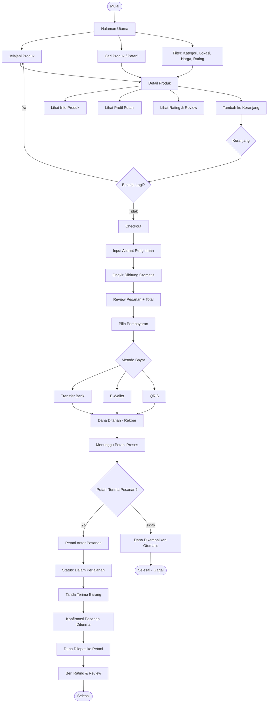
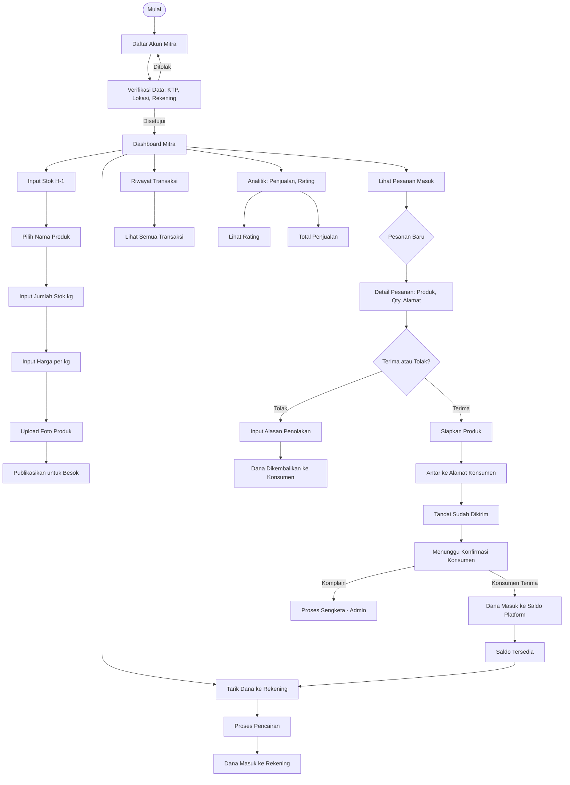
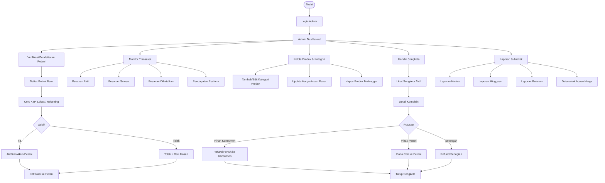
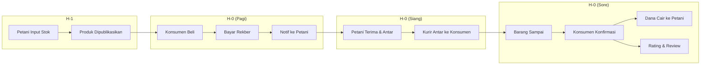

# 🥦 User Flow & Admin Flow — Platform Pangan Petani

---

## 👤 User Flow (Konsumen)

```mermaid
flowchart TD
    Start([Mulai]) --> Home[Halaman Utama]
    Home --> Browse[Jelajahi Produk]
    Home --> Search[Cari Produk / Petani]
    Home --> Filter[Filter: Kategori, Lokasi, Harga, Rating]

    Browse --> Detail[Detail Produk]
    Search --> Detail
    Filter --> Detail

    Detail --> ProdInfo[Lihat Info Produk]
    Detail --> FarmerInfo[Lihat Profil Petani]
    Detail --> RatingView[Lihat Rating & Review]
    Detail --> AddCart[Tambah ke Keranjang]

    AddCart --> Cart{Keranjang}
    Cart --> Continue{Belanja Lagi?}
    Continue -- Ya --> Browse
    Continue -- Tidak --> Checkout

    Checkout --> InputAlamat[Input Alamat Pengiriman]
    InputAlamat --> Ongkir[Ongkir Dihitung Otomatis]
    Ongkir --> Review[Review Pesanan + Total]
    Review --> Bayar[Pilih Pembayaran]

    Bayar --> PaymentMethod{Metode Bayar}
    PaymentMethod --> Transfer[Transfer Bank]
    PaymentMethod --> Ewallet[E-Wallet]
    PaymentMethod --> QRIS[QRIS]

    Transfer --> Paid[Dana Ditahan - Rekber]
    Ewallet --> Paid
    QRIS --> Paid

    Paid --> WaitOrder[Menunggu Petani Proses]

    WaitOrder --> FarmerTerima{Petani Terima Pesanan?}
    FarmerTerima -- Ya --> FarmerProses[Petani Antar Pesanan]
    FarmerTerima -- Tidak --> RefundOtomatis[Dana Dikembalikan Otomatis]
    RefundOtomatis --> EndGagal([Selesai - Gagal])

    FarmerProses --> StatusKirim[Status: Dalam Perjalanan]
    StatusKirim --> Terima[Tanda Terima Barang]
    Terima --> Konfirmasi[Konfirmasi Pesanan Diterima]

    Konfirmasi --> DanaLepas[Dana Dilepas ke Petani]
    DanaLepas --> Rating[Beri Rating & Review]
    Rating --> EndSukses([Selesai])
```

---

## 👨‍🌾 Petani Flow (Mitra)

```mermaid
flowchart TD
    Start([Mulai]) --> Daftar[Daftar Akun Mitra]
    Daftar --> Verif[Verifikasi Data: KTP, Lokasi, Rekening]
    Verif -- Ditolak --> Daftar
    Verif -- Disetujui --> Dashboard[Dashboard Mitra]

    Dashboard --> InputStok[Input Stok H-1]
    Dashboard --> LihatPesanan[Lihat Pesanan Masuk]
    Dashboard --> Riwayat[Riwayat Transaksi]
    Dashboard --> Analitik[Analitik: Penjualan, Rating]
    Dashboard --> TarikDana[Tarik Dana ke Rekening]

    InputStok --> Nama[Pilih Nama Produk]
    Nama --> Jumlah[Input Jumlah Stok kg]
    Jumlah --> Harga[Input Harga per kg]
    Harga --> Foto[Upload Foto Produk]
    Foto --> Publikasikan[Publikasikan untuk Besok]

    LihatPesanan --> OrderBaru{Pesanan Baru}
    OrderBaru --> DetailPesanan[Detail Pesanan: Produk, Qty, Alamat]
    DetailPesanan --> Decision{Terima atau Tolak?}

    Decision -- Terima --> Siapkan[Siapkan Produk]
    Siapkan --> Antar[Antar ke Alamat Konsumen]
    Antar --> KonfirmasiKirim[Tandai Sudah Dikirim]

    Decision -- Tolak --> Alasan[Input Alasan Penolakan]
    Alasan --> Refund[Dana Dikembalikan ke Konsumen]

    KonfirmasiKirim --> Tunggu[Menunggu Konfirmasi Konsumen]
    Tunggu -- Konsumen Terima --> DanaMasuk[Dana Masuk ke Saldo Platform]
    Tunggu -- Komplain --> Sengketa[Proses Sengketa - Admin]

    DanaMasuk --> Saldo[Saldo Tersedia]
    Saldo --> TarikDana
    TarikDana --> ProsesTarik[Proses Pencairan]
    ProsesTarik --> Cair[Dana Masuk ke Rekening]

    Riwayat --> LihatSemua[Lihat Semua Transaksi]
    Analitik --> RatingLihat[Lihat Rating]
    Analitik --> TotalJual[Total Penjualan]
```

---

## 🛠️ Admin Flow (Platform)

```mermaid
flowchart TD
    Start([Mulai]) --> Login[Login Admin]
    Login --> Dashboard[Admin Dashboard]

    Dashboard --> VerifMitra[Verifikasi Pendaftaran Petani]
    Dashboard --> Monitor[Monitor Transaksi]
    Dashboard --> Kelola[Kelola Produk & Kategori]
    Dashboard --> Sengketa[Handle Sengketa]
    Dashboard --> Laporan[Laporan & Analitik]

    VerifMitra --> ListDaftar[Daftar Petani Baru]
    ListDaftar --> CekData[Cek: KTP, Lokasi, Rekening]
    CekData --> Keputusan{Valid?}
    Keputusan -- Ya --> Aktifkan[Aktifkan Akun Petani]
    Keputusan -- Tidak --> Tolak[Tolak + Beri Alasan]
    Aktifkan --> NotifPetani[Notifikasi ke Petani]
    Tolak --> NotifPetani

    Monitor --> PesananAktif[Pesanan Aktif]
    Monitor --> Selesai[Pesanan Selesai]
    Monitor --> Refund[Pesanan Dibatalkan]
    Monitor --> Pendapatan[Pendapatan Platform]

    Kelola --> Kategori[Tambah/Edit Kategori Produk]
    Kelola --> HargaAcuan[Update Harga Acuan Pasar]
    Kelola --> Hapus[Hapus Produk Melanggar]

    Sengketa --> ListSengketa[Lihat Sengketa Aktif]
    ListSengketa --> DetailKomplain[Detail Komplain]
    DetailKomplain --> Putuskan{Putusan}
    Putuskan -- Pihak Konsumen --> RefundPenuh[Refund Penuh ke Konsumen]
    Putuskan -- Pihak Petani --> LepasDana[Dana Cair ke Petani]
    Putuskan -- Setengah --> RefundSebagian[Refund Sebagian]
    RefundPenuh --> TutupSengketa
    LepasDana --> TutupSengketa
    RefundSebagian --> TutupSengketa
    TutupSengketa[Tutup Sengketa]

    Laporan --> LapHarian[Laporan Harian]
    Laporan --> LapMingguan[Laporan Mingguan]
    Laporan --> LapBulanan[Laporan Bulanan]
    Laporan --> DataBPS[Data untuk Acuan Harga]
```

---

## 🔄 End-to-End Flow (Simplified)

```mermaid
flowchart LR
    subgraph "H-1"
        Petani[Petani Input Stok] --> Publikasi[Produk Dipublikasikan]
    end
    subgraph "H-0 (Pagi)"
        Publikasi --> Konsumen[Konsumen Beli]
        Konsumen --> Bayar[Bayar Rekber]
        Bayar --> NotifPetani[Notif ke Petani]
    end
    subgraph "H-0 (Siang)"
        NotifPetani --> PetaniProses[Petani Terima & Antar]
        PetaniProses --> Kurir[Kurir Antar ke Konsumen]
    end
    subgraph "H-0 (Sore)"
        Kurir --> Sampai[Barang Sampai]
        Sampai --> Konfirm[Konsumen Konfirmasi]
        Konfirm --> DanaCair[Dana Cair ke Petani]
        Konfirm --> RatingReview[Rating & Review]
    end
```
